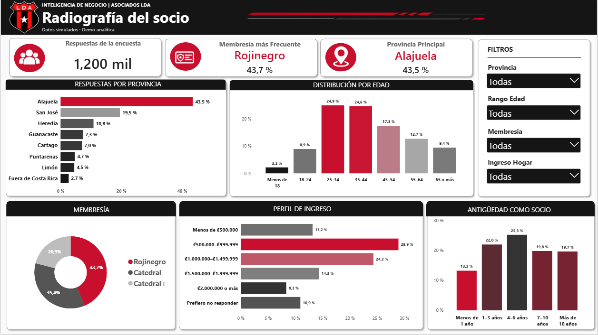
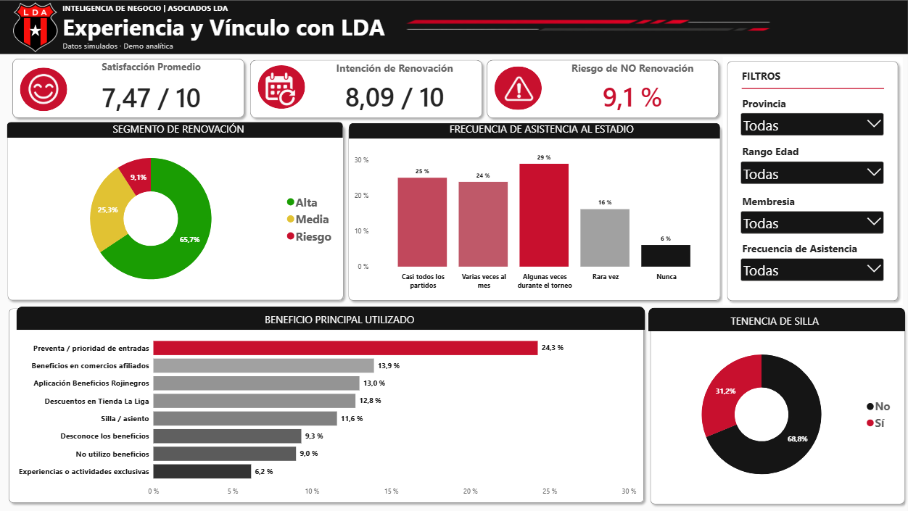
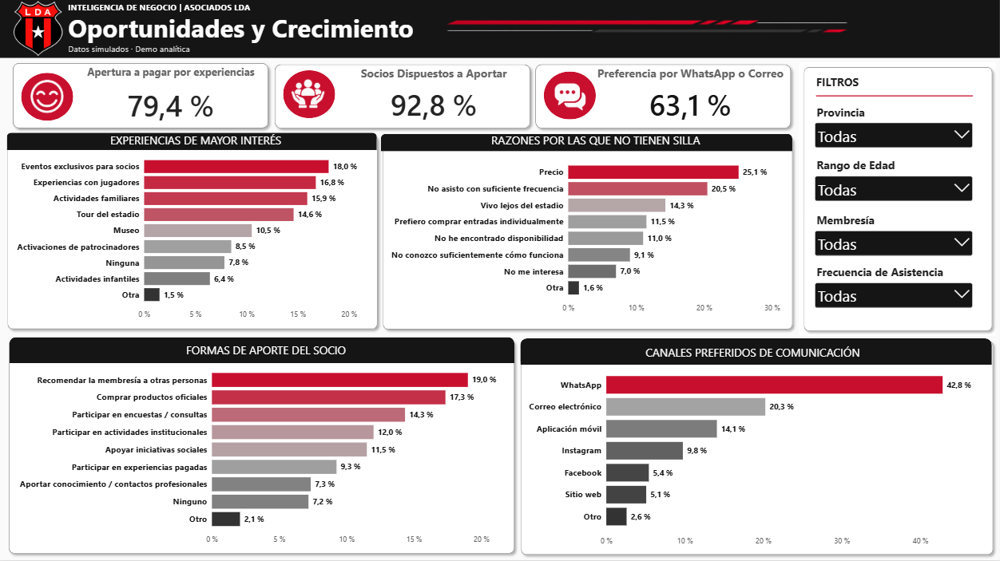
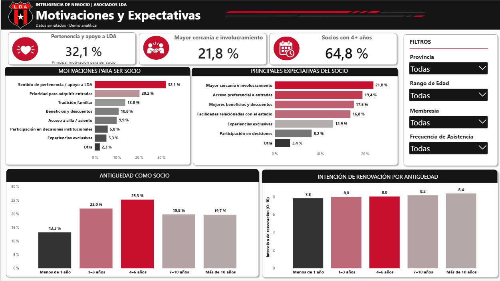
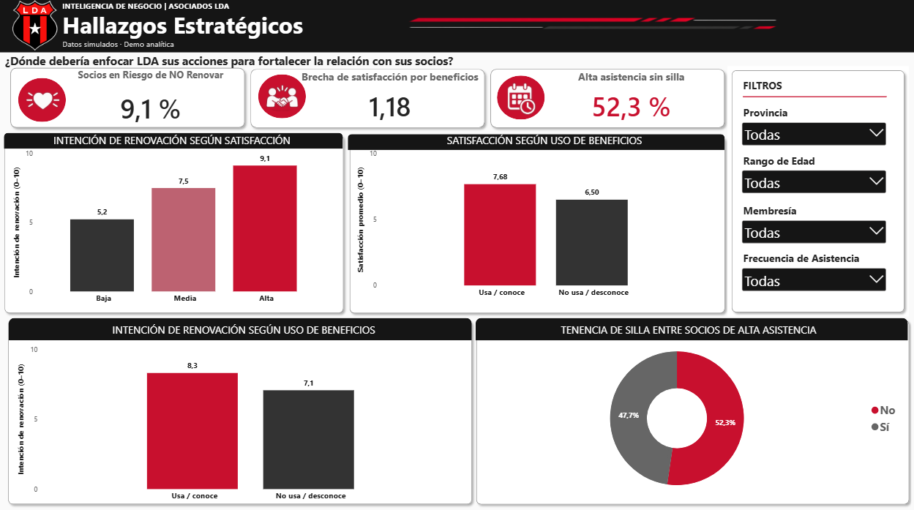

# Customer & Partner Analytics Dashboard — Power BI

## Overview

Power BI Business Intelligence demo analyzing customer and partner profiles, satisfaction, engagement, preferences, and strategic opportunities using simulated data.

This project demonstrates how Business Intelligence can transform survey data into interactive dashboards and actionable business insights.

> **Important:** All data used in this project is simulated and generated exclusively for demonstration purposes. The results do not represent real information from Liga Deportiva Alajuelense (LDA).

## Project Objective

The objective of this dashboard is to demonstrate how Power BI can support the analysis of customer and partner information through:

* Customer profile analysis
* Satisfaction and engagement measurement
* Renewal intention analysis
* Preference and behavior analysis
* Identification of business opportunities
* Interactive data exploration
* Strategic insight generation

The dashboard is based on a simulated survey containing **1,200 responses**.

## Dashboard Pages

### 1. Customer Profile

Provides an overview of the customer base, including:

* Geographic distribution
* Age ranges
* Membership type
* Income level
* Membership tenure

### 2. Experience & Engagement

Analyzes the relationship between customers and the organization through:

* Satisfaction levels
* Renewal intention
* Potential non-renewal risk
* Valued benefits
* Stadium attendance
* Seat ownership

### 3. Opportunities & Growth

Explores potential opportunities based on:

* Willingness to pay for experiences
* Willingness to contribute
* Experiences of interest
* Reasons for not owning a seat
* Preferred communication channels

### 4. Motivations & Expectations

Analyzes:

* Reasons for becoming a member
* Customer expectations
* Membership tenure
* Renewal intention by years of membership

### 5. Strategic Findings

Brings together key relationships identified in the analysis, including:

* Satisfaction and renewal intention
* Benefit usage and benefit awareness
* Stadium attendance and seat ownership
* Main opportunities identified across the dataset

These findings describe relationships observed in the simulated data and should not be interpreted as causal conclusions.

## Dashboard Preview

<p align="center">
  
  
</p>

<p align="center">
  
  
</p>

<p align="center">
  
</p>

## Interactivity

The dashboard includes interactive filters and visual interactions that allow users to explore the data by:

* Province
* Age range
* Membership type
* Attendance frequency

Selecting categories within visualizations also updates related elements throughout the dashboard.

## Tools & Technologies

* Microsoft Power BI
* Power Query
* DAX
* Microsoft Excel
* Data Analysis
* Data Visualization
* Dashboard Design

## Project Structure

```text
customer-partner-analytics-powerbi/
│
├── Datos Simulados/
│   └── Datos_Simulados_LDA.xlsx
│
├── Documentación/
│   ├── Dashboard Demo BI LDA.pdf
│   └── Guia Dashboard Demo BI LDA.docx
│
├── Power BI/
│   └── Dashboard LDA.pbix
│
├── images/
│   ├── 01-customer-profile.png
│   ├── 02-experience-engagement.png
│   ├── 03-opportunities-growth.png
│   ├── 04-motivations-expectations.png
│   └── 05-strategic-findings.png
│
└── README.md
```

## How to Use

The `.pbix` file contains the simulated dataset already loaded, so the dashboard can be opened and explored directly in Power BI Desktop.

> **Note:** Do not select **Refresh** when opening the file. The original data source uses a local development path.

The simulated Excel dataset is included for reference and for future modifications. If the data needs to be refreshed, the source path must first be updated in Power BI.

## Disclaimer

This project is an independent Business Intelligence demonstration created for portfolio purposes.

All data is simulated. Any similarity to real individuals, customers, organizations, or business information is coincidental.

## Author

**Emily Alvarado**

Software Engineer | Data Analytics | Cybersecurity | AI Enthusiast
